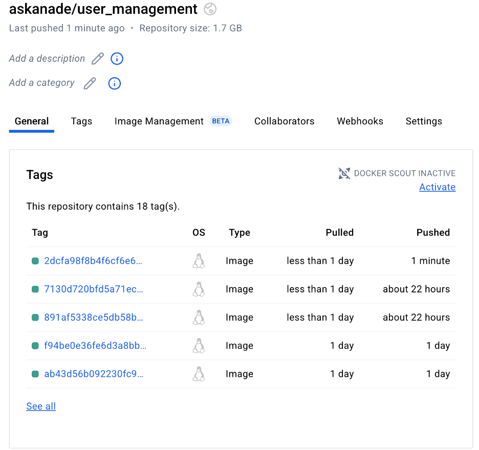
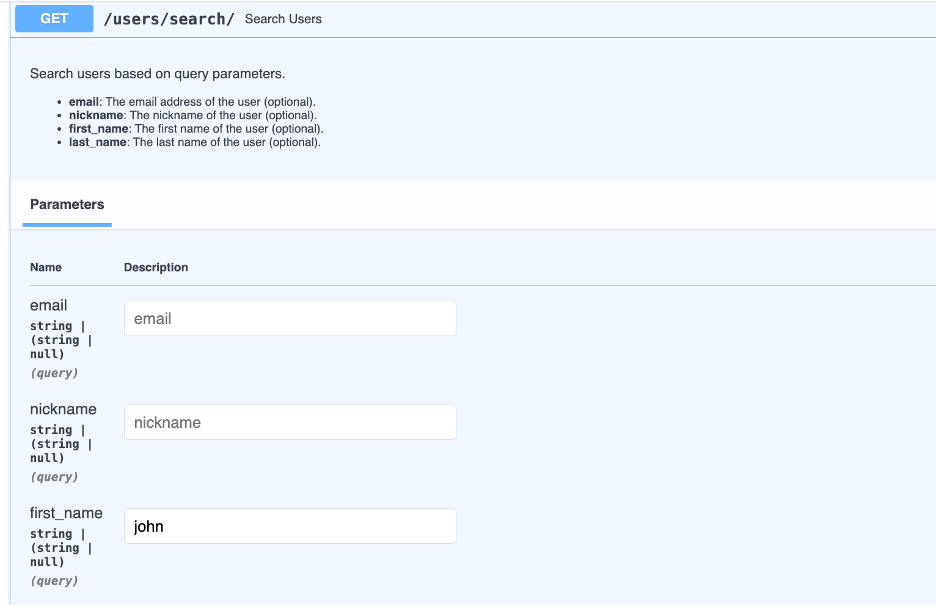
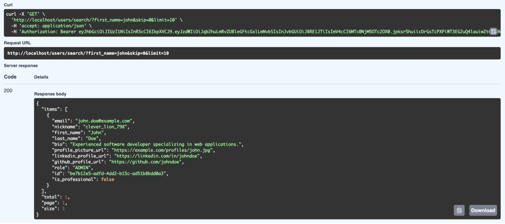

# The User Management System 

## Issues Resolved

**Issue 1 - Email Not Sent to Mailtrap**

When a new user signed up, the system didn’t send a verification email. This is now fixed by properly setting up the email service so it sends the email when a user is created.

[Issue1]( https://github.com/ASKANADE18/user_management/issues/1)

**Issue 2 - Admin Could Skip Email Verification**
Admins were able to access the system without verifying their email, which shouldn't happen. Now, admins must verify their email just like other users.

[Issue2](https://github.com/ASKANADE18/user_management/issues/3)

**Issue 3 - Weak Passwords Allowed**
Passwords like "12345678" were accepted, which isn't safe. The system now checks for strong passwords with capital letters, small letters, numbers, and special characters.

[Issue3](https://github.com/ASKANADE18/user_management/issues/5)

**Issue 4 - Wrong Role Change on Verification**
When a user verified their email, their role was wrongly changed to "AUTHENTICATED" even if they were an "ADMIN". Now, only users with the role "ANONYMOUS" get updated to "AUTHENTICATED" after verification.

[Issue4](https://github.com/ASKANADE18/user_management/issues/7)

**Issue 5 - Unauthorized Error for Token Issues**
If a token was missing or invalid, trying to delete a user gave a 401 error. This is now fixed by making the token check more reliable.

[Issue5](https://github.com/ASKANADE18/user_management/issues/9)

## Docker Hub Repository
Link - [Docker_Repository](https://hub.docker.com/repository/docker/askanade/user_management/general)

Docker image for this project on Docker Hub:

 

## New Feature

The Search and Filtering feature helps admins quickly find and manage users. They can look up users by username, email, or role, and filter them by account status or when they registered. This makes user management faster and easier.

**Input-**

 

**Output-**
 
 

## New Tests
New Tests are in test branch - [Tests](https://github.com/ASKANADE18/user_management/tree/test-coverage-enhancement)

## My Experience

I come from a software development background, mainly working with SAP technologies, so I didn’t have much experience with Python before this course. But this class really helped me learn and grow. Thanks to Professor Keith Williams' clear teaching and the way the course was structured, I got to explore and use tools like Docker, GitHub Actions, and Faker — all of which were completely new to me.

The hands-on assignments were very helpful. I worked on real-world tasks like building a QR Code API, handling user registrations, and deploying projects with DockerHub. These assignments taught me how to use Git for version control, set up continuous integration, and write automated tests — just like in real software development jobs.

One of the most useful parts of the course was learning how to improve test coverage and work with APIs, user login systems, and container-based apps. Professor Williams also gave us plenty of resources and guidance, which made learning smooth and less stressful. Each assignment built on the previous one, so I never felt lost.

By the end of this course, I feel much more confident using Python, working with APIs, and contributing to projects that use Docker and other modern tools. I’m excited to use these new skills in my future work.
